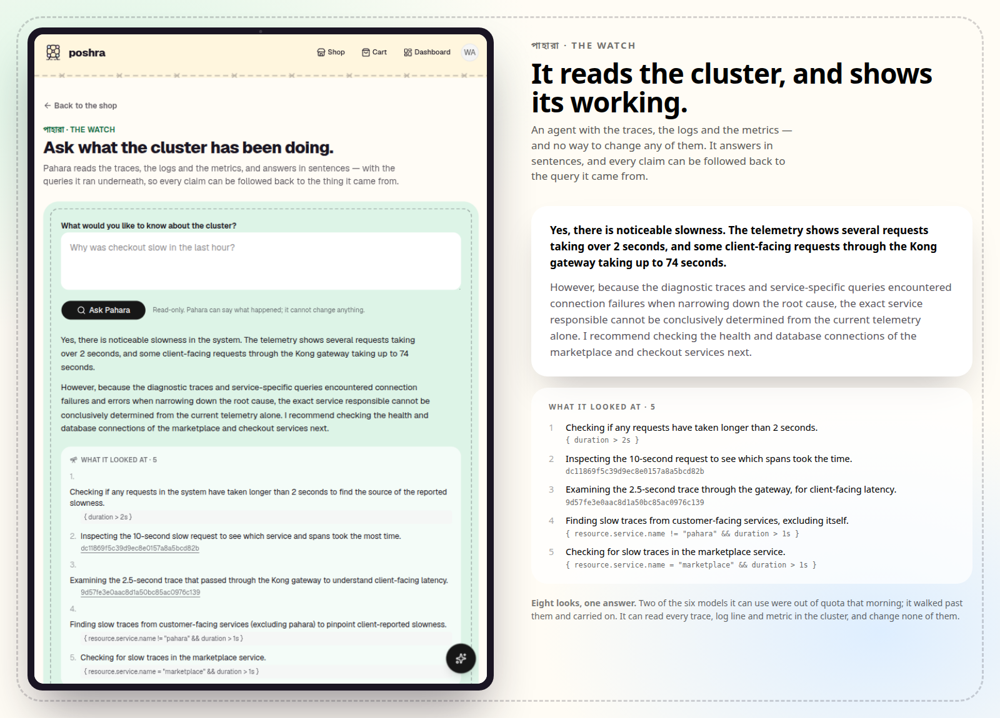
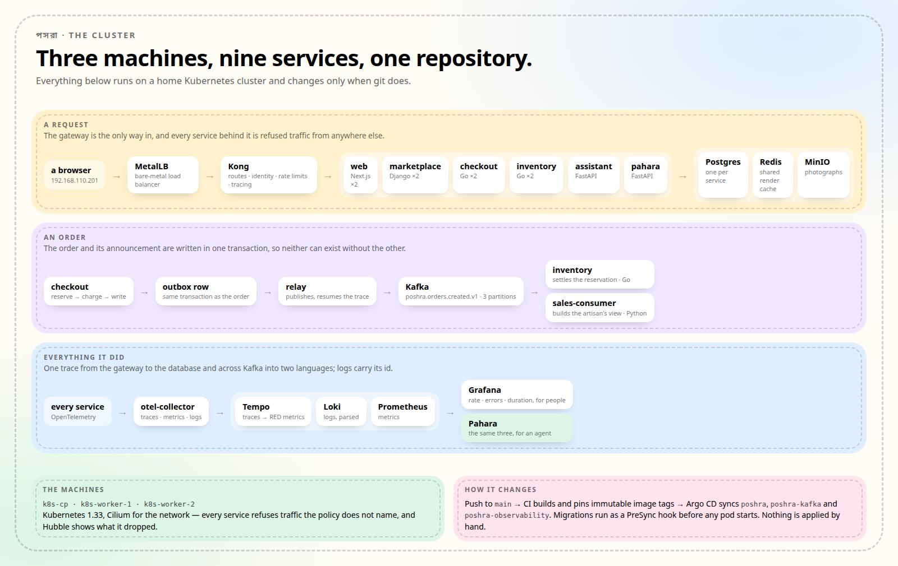

  

<h1 align="center">Poshra</h1>

  <strong>Crafts from Bangladesh, sold the way they deserve.</strong> 
  <em>পসরা — the spread of goods a trader lays out at the fair.</em>

  

  
    Next.js · Django · Go · Kong · Kafka · gRPC · Postgres · Kubernetes ·
    OpenTelemetry · Gemini&nbsp;/&nbsp;Claude
  

  

---

## What it is

A marketplace that connects Bangladeshi artisans to buyers abroad and keeps the maker
attached to the work: every piece says who made it and which district it came from.

**Buyers** ask in plain language — *"a wedding gift under ৳8,000"*, *"something handwoven
from Sylhet"* — and get real pieces back, not keyword soup. **Artisans** photograph a piece
and say what it is out loud, in Bangla, and get a listing in English to correct: title,
description, materials and a price judged against comparable work already in the shop.
**Agents** get the storefront as a set of described tools; the model can fill a cart but
never spend money — buying ends with a human on the checkout page.

Nothing the model writes is published. It fills a form the artisan corrects, for the same
reason it can total a cart but not pay for it.

**Whoever keeps the shop** sees all of it: every artisan's listings, what sold, and a note
against a piece when something needs changing — archived with a reason rather than deleted,
and the artisan can answer it.

  

---

## Built like production

Nine services behind an API gateway on a three-node Kubernetes cluster, deployed by GitOps,
with all three observability signals joined up.

  

One trace runs from the gateway to the database **and across Kafka into two languages**: the
order's trace context is written into the outbox row, resumed by the relay, and picked up
independently by a Go consumer and a Python one. The publish span's duration *is* outbox
latency; the gap before a consume span *is* consumer lag. Logs are structured JSON parsed on
the way into Loki and carry that trace id; RED metrics are derived from the spans themselves.
Hubble shows every flow Cilium allows or drops, so a NetworkPolicy is visible rather than
assumed, and Argo CD makes git the only way the cluster changes — migrations run as a PreSync
hook before any pod starts.

  

