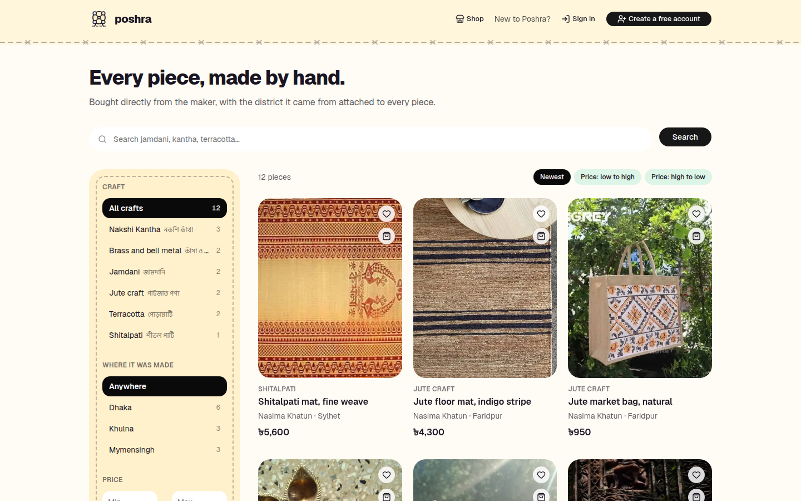
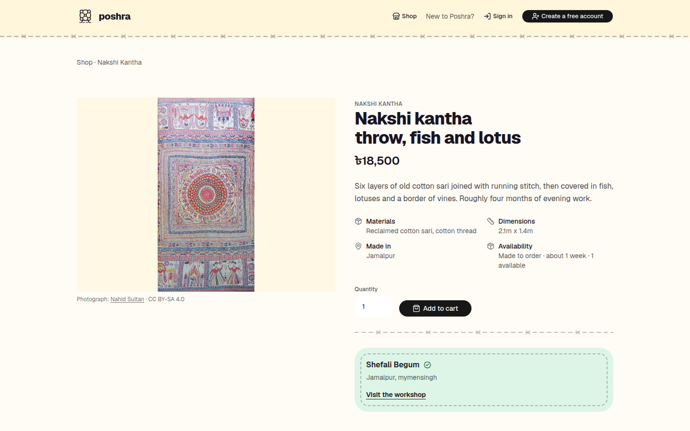
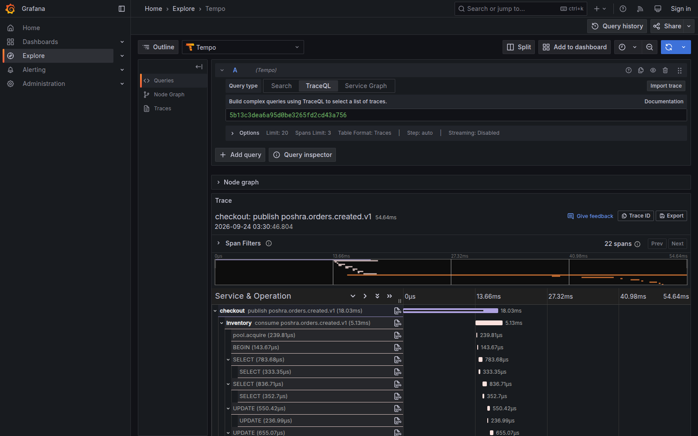
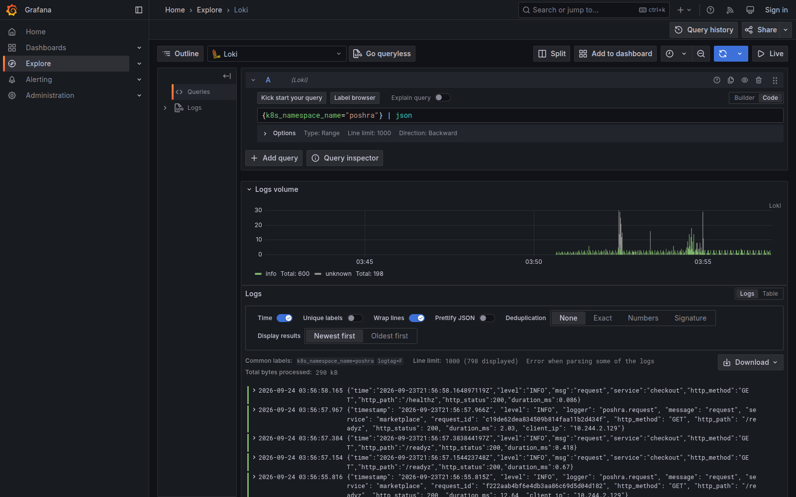
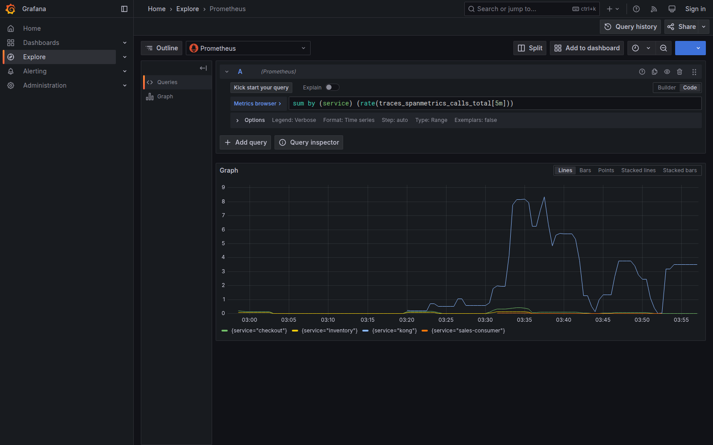
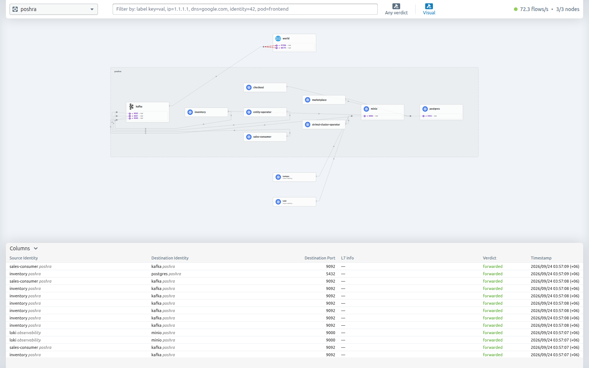
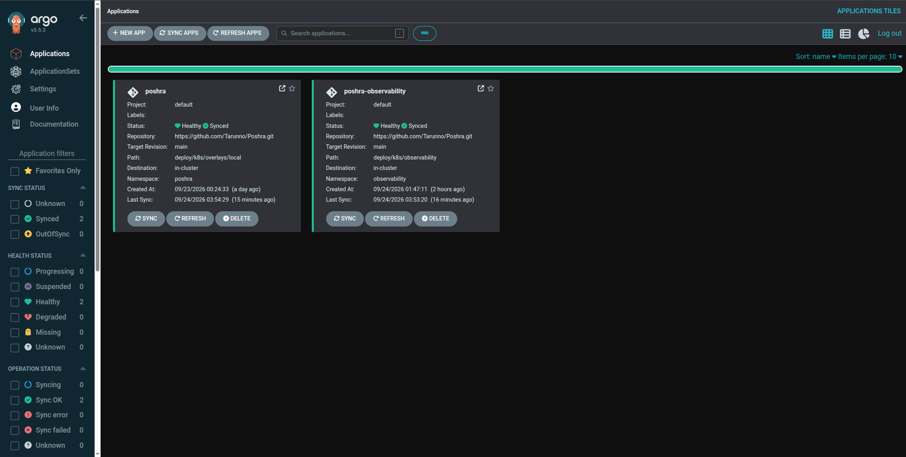

<p align="center">
  
</p>

<h1 align="center">Poshra</h1>

<p align="center">
  <strong>Crafts from Bangladesh, sold the way they deserve.</strong><br>
  <em>পসরা — the spread of goods a trader lays out at the fair.</em>
</p>

<p align="center">
  
</p>

<p align="center">
  <sub>
    Next.js · Django · Go · Kong · Kafka · gRPC · Postgres · Kubernetes ·
    OpenTelemetry · Gemini&nbsp;/&nbsp;Claude
  </sub>
</p>

---

## What it is

A marketplace that connects Bangladeshi artisans to buyers abroad, and keeps the maker
attached to the work: every piece says who made it and which district it came from.

**For the buyer** — ask for what you want in plain language. *"A wedding gift under ৳8,000."*
*"Something handwoven from Sylhet."* You get real pieces, with the maker attached.

**For the artisan** — list a piece, add photographs, watch what sells. No listing fee, no
English required.

**For AI agents** — the storefront is a set of well-described tools, so an assistant can
search and fill a cart on someone's behalf. It cannot spend their money: buying always
ends with a human on the checkout page.

---

## What it looks like

| | |
|---|---|
|  |  |
| **Shop** — filter by craft, region and price, with counts that update together | **A piece** — the maker, the district it came from, and what it is made of |

---

## Built like production

Nine services behind an API gateway on a three-node Kubernetes cluster, deployed by GitOps,
with all three observability signals joined up.

### Every request, end to end



One trace from the gateway to the database — **and across Kafka into two languages.** An
order's trace context is written into the outbox row, resumed by the relay, and picked up by
a Go consumer and a Python consumer independently. The publish span's duration *is* the
outbox's latency; the gap before a consume span *is* consumer lag.

### Logs and metrics that answer the next question

| | |
|---|---|
|  |  |
| **Logs** — structured JSON, parsed on the way in, so `level = error` is a query | **Metrics** — rate, errors and duration per service, derived from the traces themselves |

### The network, and the deploys

| | |
|---|---|
|  |  |
| **Hubble** — every flow Cilium allows or drops, so a NetworkPolicy is visible rather than assumed | **Argo CD** — git is the deployment; migrations run as a PreSync hook before any pod starts |

---

## How it hangs together

```
                  ┌─ marketplace (Django) ── catalog, artisans, accounts, sales read model
browser ─ Kong ───┼─ checkout (Go) ──gRPC──▶ inventory (Go) ── the single authority on stock
                  ├─ assistant (Python) ──── tool-using model over the catalog and cart
                  └─ web (Next.js) ───────── server-rendered storefront

checkout ──outbox──▶ Kafka ──┬──▶ inventory     settles the reservation
                             └──▶ marketplace   builds the artisan's sales view
```

A few decisions worth the words:

- **Stock has one owner.** Overselling is prevented by a conditional update in one service,
  not by hoping two services agree. Proven by a concurrency test: ten buyers, three in stock.
- **Orders use a saga with compensation**, because no transaction spans a payment processor.
  A declined card releases the hold immediately; a crash lets it expire.
- **The outbox makes the order and its announcement atomic.** Delivery is at-least-once, so
  every consumer is idempotent — which is what makes replaying a topic safe.
- **The model cannot take money.** It fills a cart and hands over; the purchase goes through
  the same reviewed path as the storefront.

---

## Running it

```bash
make k8s-secrets            # generated passwords and keys, once
make k8s-secret-llm         # GEMINI_API_KEY=... or ANTHROPIC_API_KEY=...
make kafka-operator kafka   # Strimzi, then the cluster and its topics
kubectl apply -f deploy/argocd/                 # Argo takes it from here
kubectl apply -k deploy/k8s/observability       # collector, Tempo, Loki, Prometheus, Grafana
```

Everything else is git: push to `main`, CI builds and pins immutable image tags, Argo syncs.

---

## Where it stands

| | |
|---|---|
| ✅ Storefront | Search, facets, product and artisan pages, cart, checkout, orders |
| ✅ Artisans | Listings with photo upload, stock, sales analytics |
| ✅ Events | Outbox → Kafka → consumers in Go and Python, stock kept in step |
| ✅ Observability | Traces, logs and metrics, correlated, from the gateway down |
| ✅ Shopping assistant | Tool-using model over the catalog and cart, provider-swappable |
| 🔜 Listing generation | Photograph and a Bangla voice note to a finished listing |
| 🔜 MCP storefront | The same tools over the Model Context Protocol |
| 🔜 Pahara | An agent that reads the traces and says why something broke |

---

## The design

The interface is built from the crafts it sells: pastel patches joined by a running stitch,
the way a nakshi kantha quilt is made. The mark is a **nagordola**, the hand-cranked wooden
wheel that turns at every village fair. Illustrations are hand-drawn SVG.

Photographs of the seeded catalogue come from Wikimedia Commons and carry their
photographer and licence, because most open licences require it.
