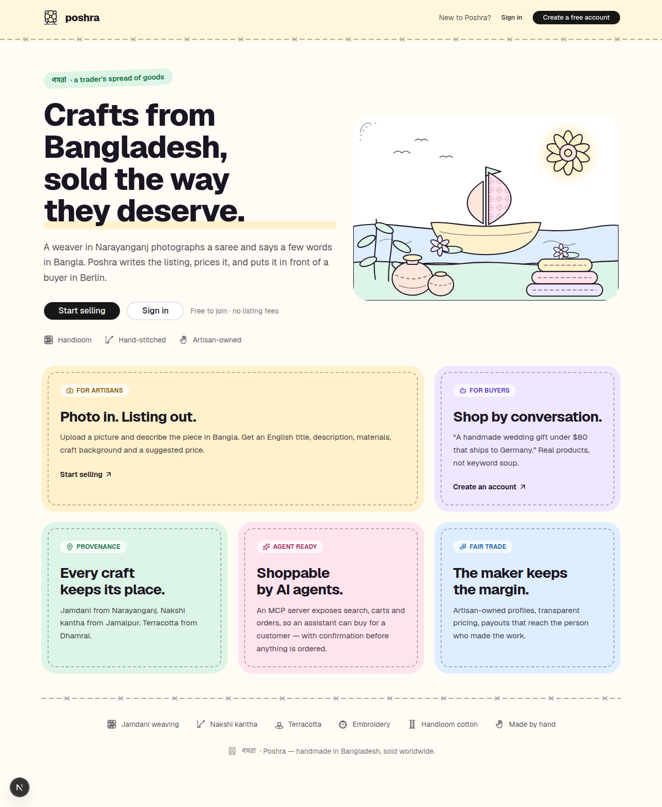

<p align="center">
  
</p>

<h1 align="center">Poshra</h1>

<p align="center">
  <strong>Crafts from Bangladesh, sold the way they deserve.</strong><br>
  <em>পসরা — the spread of goods a trader lays out at the fair.</em>
</p>

<p align="center">
  
</p>

---

## The problem

Bangladesh makes some of the finest handwork in the world — jamdani woven in Narayanganj,
nakshi kantha stitched in Jamalpur, terracotta fired in Dhamrai. Very little of it reaches a
buyer directly.

The artisans who make it rarely write English, and an online listing is mostly writing:
a title that gets found, a description that sells, materials, measurements, a price that is
neither insulting nor unsellable. So the work passes through middlemen who take the margin and
lose the story, or it never gets listed at all.

## What Poshra does

**For the artisan.** Photograph the piece, describe it out loud in Bangla. Poshra writes the
listing: title, description, materials, the craft's background, and a suggested price based on
what similar work sells for. No typing, no English, no listing fee.

**For the buyer.** Say what you actually want — *"a handmade wedding gift under $80 that ships to
Germany"* — and get real pieces that match, with the maker and the origin attached to each one.
Every craft keeps its place: this saree was woven in Narayanganj, by this person.

**For AI agents.** The storefront is exposed over the Model Context Protocol, so an assistant can
search, fill a cart and place an order on someone's behalf — with an explicit confirmation before
anything is bought.

**For the maker's share.** Artisan-owned profiles, transparent pricing, and payouts that reach the
person whose hands made the work.

## How it works

| | |
|---|---|
| **1. Photograph and speak** | The artisan uploads a photo and a Bangla voice note. |
| **2. Poshra writes the listing** | Title, description, materials, craft background, suggested price — reviewed by the artisan before it goes live. |
| **3. Buyers find it by asking** | Conversational search matches intent, budget and shipping country, not keywords. |
| **4. The order reaches the maker** | Stock reservation, payment and fulfilment, with the margin going to the artisan. |

## Where it stands

Early development, built in the open.

| | |
|---|---|
| ✅ Accounts | Registration, sign-in, rotating sessions, artisan and buyer roles |
| ✅ Storefront shell | Home, sign-up, sign-in, dashboard |
| ✅ Running in production-shape | Gateway, database and services on Kubernetes, deployed by GitOps |
| 🔜 Catalog | Products, artisan profiles, craft origins, search |
| 🔜 Listing generation | Photo and voice note to a finished listing |
| 🔜 Checkout | Cart, stock reservation, orders |
| 🔜 Conversational shopping and the agent storefront | |

## The design

The interface is built from the crafts it sells: pastel patches joined by a running stitch, the
way a nakshi kantha quilt is made. The mark is a **nagordola**, the hand-cranked wooden wheel that
turns at every village fair. Illustrations are hand-drawn SVG, so the artwork carries the same
palette as the product and stays sharp at any size.

## Running it locally

```bash
cp .env.example .env     # then set the passwords and keys (make jwt-keys)
make up                  # Postgres, the marketplace service and the gateway
make migrate             # apply database migrations
cd apps/web && npm install && npm run dev
```

Open <http://localhost:8080>. Everything is served through the gateway, so the app and the API
share one origin.

## Under the hood

Next.js and shadcn/ui on the front, Django and Go services behind a Kong gateway, Kafka between
them, Postgres with PostGIS underneath, and Claude for the AI features. It runs on Kubernetes,
deployed from git by Argo CD.

| Path | What lives here |
|---|---|
| `apps/web` | Next.js storefront and artisan dashboard |
| `services/marketplace` | Django: accounts, artisans, catalog, orders |
| `services/checkout`, `services/inventory` | Go: order orchestration and stock |
| `services/assistant`, `services/mcp-storefront` | Python: Claude features and the agent storefront |
| `gateway/kong` | Gateway config and custom Lua plugins |
| `deploy` | Docker Compose, Kubernetes manifests, Argo CD |
| `docs/adr` | Why things are built the way they are |

Design decisions are recorded as [architecture decision records](docs/adr).
